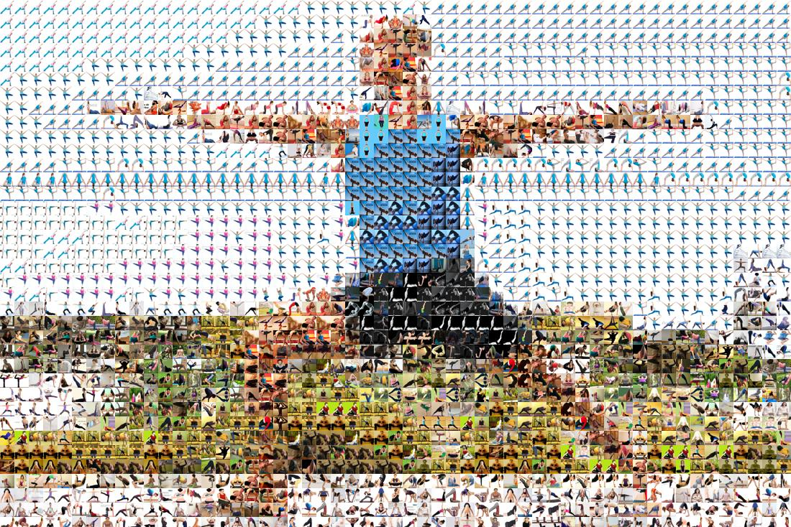

# Yoga Pose Classification Model



## Introduction
This is a yoga pose classification model that explores several different options for determining the pose of a person in an image. The purpose of this exercise was to determine if body keypoints can help make an image model more successful in classifying human activities and positions.

The model is trained off a combination of two different datasets publicly available on Kaggle:

1. [Yoga Pose Image Classification Dataset](https://www.kaggle.com/shrutisaxena/yoga-pose-image-classification-dataset)
2. [Yoga Posture Dataset](https://www.kaggle.com/tr1gg3rtrash/yoga-posture-dataset)

Note: I am awaiting approval for an additional dataset that could make this model more robust. The dataset is available at [Yoga 82](https://sites.google.com/view/yoga-82/home).

## Performance
Performance was considered across several different model strategies. The first two simply gathered x,y bopdy keypoints from images. The third model used a pre-trained ResNet50 model to classify the image purely based on image content and finally the last model, attempts to utilize both body keypoints and image data to classify the pose.

The following table shows the performance of each model strategy:

| Model Strategy | Accuracy |
| --- | --- |
| Keypoint Detection + RandomForestClassifier | 0.599 |
| ResNet50 + Transfer Learning | 0.705 |
| ResNet50 + Transfer Learning + Keypoints | ?¿? |

The best model, a pre-trained ResNet50 model which  is able to achieve a **70% accuracy across 82 different classes**. Given that many of the classes contained less than 100 images, this model generalizes well.

Upon researching some of the misclassified images, it was found in several instances that the model was able to correctly classify the pose, but the image itself was misclassified. This is likely due to the fact that the data was scraped from the web and does not represent the cleanest type of datapoints.

### Future Research

There are a number of items that could be explored to help improve the efficiency of the model:
- **More Robust Dataset** - The dataset used for this project was scraped from the web. While this was a good starting point, the dataset was not as clean as it could have been. There were several images that were misclassified and several images that did not contain a human. A more robust dataset would help improve the accuracy of the model.
- **Unsupervised Learning to Filter out Data** - It may be worth exploring unsupervised learning methods to see if a model run before the classification model can learn to cluster the images into groups. This could help reduce the number of improperly labeled classes and improve the accuracy of the model.
- **More Data** - The dataset used for this project was relatively small. There were less than 100 images for nearly every class. This is not enough data to train a robust model. More data would help improve the accuracy of the model.
- **Hierarchy of Yoga Poses** - The dataset used for this project contained 82 classes of yoga poses. It may be worth exploring the possibility of grouping these classes into a hierarchy of poses. For example grouping poses into groups such as Standing, Sitting, Balancing, Inverted, etc. This could help improve the accuracy of the model.

## Getting Started

This project is built off of [Detectron2](https://github.com/facebookresearch/detectron2/), Meta's open source library for computer vision-based applications such as object detection, segmentation, and pose estimation. While it is possible to run this project on a local machine, it is recommended to run this project on a GPU-enabled machine.

### Prerequisites
* Python 3.8
* GPU-enabled machine
* Kaggle API Key (See directions [here](https://www.kaggle.com/discussions/general/74235))

### Installing
1. Clone the repo
```
git clone git@github.com:oftenfrequent/yoga-pose-classification.git
```
2. Set up Virtual Environment
```
python3 -m venv .venv
source .venv/bin/activate

# or
pyenv virtualenv 3.8 pose-classifier
pyenv activate pose-classifier
```
3. Install the required packages
```
pip install -r requirements.txt
```
4. Set up environment variables from `.env.example` and update values as needed.
```
cp .env.example .env
```
5. Download the Datasets via file 
```
bash data-download.sh
```
This will produce the following directory structure:
```
data
├───yoga-pose-classification
│   ├───dataset
│   │   ├───yoga-pose-1-name
│   │   │   ├───image_file_01.jpg
│   │   │   ├───image_file_02.png
│   │   │   ├───image_file_...
│   │   ├───yoga-pose-2-name
│   │   │   ├───image_file_...
├───yoga-posture-dataset
│   ├───yoga-pose-1-name
│   │   ├───image_file_01.jpg
│   │   ├───image_file_02.png
│   │   ├───image_file_...
...
```
6. Run through the notebooks in sequential order found in the root directory to generate the keypoints for the images and train models.


